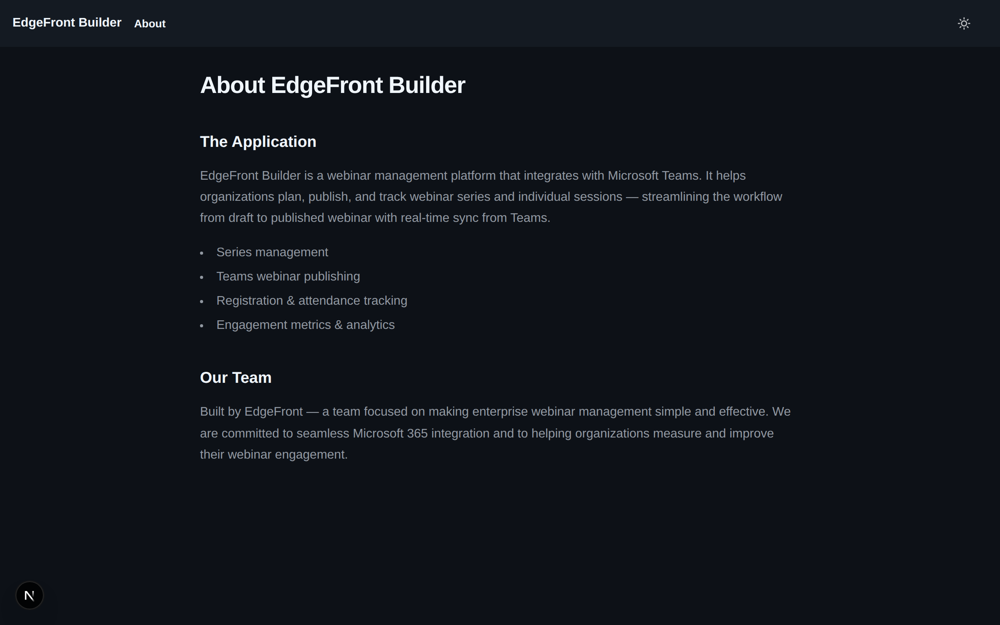

# EdgeFront Builder

EdgeFront Builder is a **webinar management platform** for local event planning, participation tracking, and engagement analytics. It helps organizations manage webinar series and individual sessions while preparing normalized event data for ingestion-first reporting workflows.


---

## Key Capabilities

- **Series & session management** — Create webinar series containing multiple sessions; manage titles, schedules, presenters, and coordinators.
- **People roles** — Assign presenters and co-organizers per session using a live Entra ID people picker.
- **Registration & attendance tracking** — Stores normalized registration and attendance records received from external ingestion sources into the local data model.
- **Metrics & analytics** — Aggregated engagement metrics per session and across a series: total registrations, attendees, unique account domains, and warm-account influence tracking.
- **Entra ID authentication** — Single-tenant login via Entra ID.

---

## Screenshots

### Sign In


### Series List


### Create a Series


### Series Detail with Metrics


### Create a Session


### Session Detail — Draft


### Session Detail


### About



---

## Tech Stack

| Layer | Technology |
|---|---|
| Frontend | Next.js 16 (App Router), React 19, TypeScript, Tailwind CSS v4, Primer React v38 |
| Backend | ASP.NET Core Minimal API, .NET 10, EF Core |
| Database | Azure SQL |
| Auth | Microsoft Entra ID (next-auth, single-tenant) |
| Graph integration | Microsoft Graph v1 — delegated user profile search |
| Hosting | Azure App Service |

---

## Project Structure

```text
docs/           # Setup guides, screenshots
src/
  backend/      # ASP.NET Core Minimal API
  frontend/     # Next.js App Router app
tests/
  backend/      # xUnit tests for backend
tools/          # PowerShell scripts (e.g., Entra app registration)
```

---

## Architecture Overview

- **Monolith with modular boundaries** — vertical-slice feature organization in the backend, App Router feature directories in the frontend.
- **Ingestion-ready data model** — normalized registration and attendance records are persisted locally and remain the foundation for follow-on ingestion work.
- **Metrics persisted on write** — all metric aggregations are computed and stored on write; no compute-on-read.
- **Delegated-only Graph permissions** — authenticated user context is required for supported directory lookups.

---

## Entra App Registration

See [`docs/setup-entra-permissions.md`](docs/setup-entra-permissions.md) for step-by-step instructions, or run the automated script:

```powershell
tools/update-app-registration.ps1
```

Required delegated permissions:

| Permission | Purpose |
|---|---|
| `openid`, `profile`, `email`, `offline_access` | Standard OIDC sign-in |
| `User.ReadBasic.All` | People search for presenter/coordinator picker |

Exposed API scope: `api://{ClientId}/access_as_user` (frontend → backend token exchange).

This phase removes Teams webinar publish/sync API dependencies so installs do not require Teams webinar app registration consent paths.
