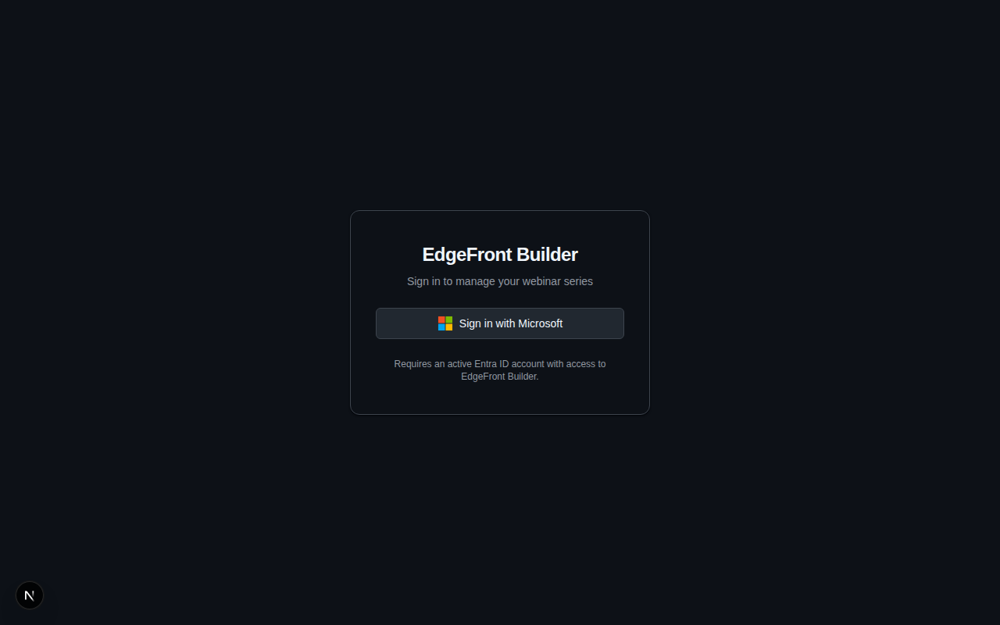
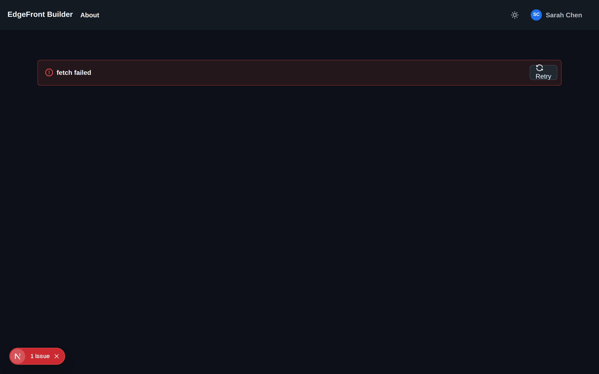
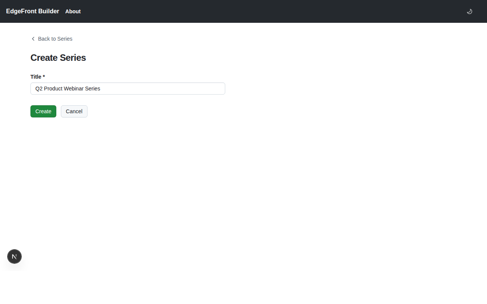
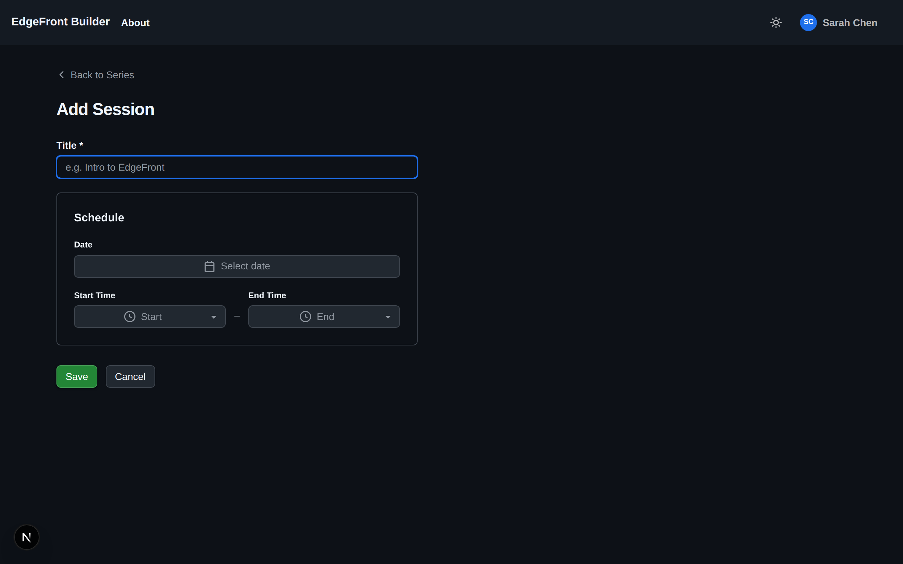
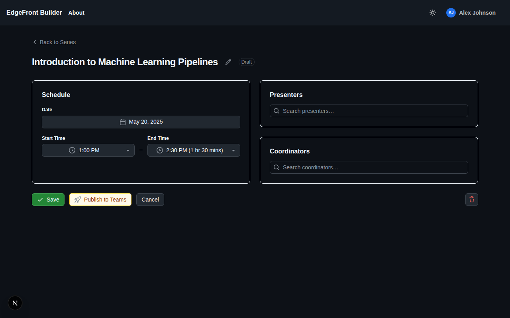
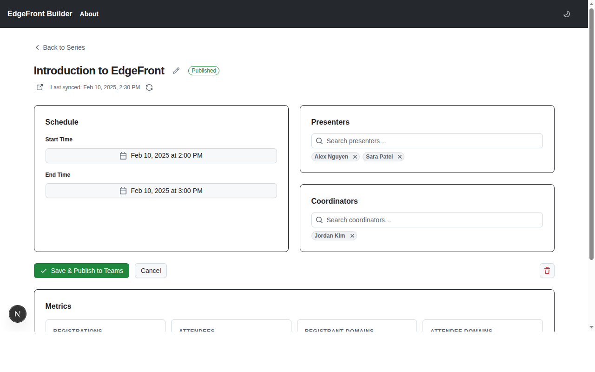

# EdgeFront Builder

EdgeFront Builder is a **webinar management platform** that integrates with Microsoft Teams. It helps organizations plan, publish, and track webinar series and individual sessions — streamlining the workflow from draft to published webinar with real-time sync from Teams.


---

## Key Capabilities

- **Series & session management** — Create webinar series containing multiple sessions; manage titles, schedules, presenters, and coordinators.
- **Teams webinar publishing** — Publish a series to automatically create Teams webinars for every session via the Microsoft Graph API.
- **People roles** — Assign presenters and co-organizers per session using a live Entra ID people picker; changes sync to Teams automatically.
- **Registration & attendance tracking** — Sync registrations and attendance from Teams on page load; data is persisted locally for fast reads.
- **Drift detection** — Detect when Teams-side metadata (title, start, end) diverges from Builder and surface a warning badge so you can reconcile.
- **Metrics & analytics** — Aggregated engagement metrics per session and across a series: total registrations, attendees, unique account domains, and warm-account influence tracking.
- **Entra ID authentication** — Single-tenant login via Entra ID; all Graph operations use delegated OBO tokens — no application permissions required.

---

## Screenshots

### Sign In



### Series List



### Create a Series



### Series Detail with Metrics


### Publish Series to Teams


### Create a Session



### Session Detail — Draft



### Session Detail — Published with Sync & Metrics



---

## Tech Stack

| Layer | Technology |
|---|---|
| Frontend | Next.js 16 (App Router), React 19, TypeScript, Tailwind CSS v4, shadcn/ui |
| Backend | ASP.NET Core Minimal API, .NET 10, EF Core |
| Database | Azure SQL |
| Auth | Microsoft Entra ID (MSAL / next-auth, single-tenant) |
| Graph integration | Microsoft Graph v1 — delegated `VirtualEvent.ReadWrite` via OBO flow |
| Hosting | Azure App Service |

---

## Project Structure

```text
docs/           # Specs, setup guides, screenshots
src/
  backend/      # ASP.NET Core Minimal API
  frontend/     # Next.js App Router app
tests/
  backend/      # xUnit tests for backend
tools/          # PowerShell scripts (e.g., Entra app registration)
```

---

## Architecture Overview

- **Monolith with modular boundaries** — vertical-slice feature organization in the backend, App Router feature directories in the frontend.
- **User-initiated data sync** — registrations and attendance are pulled from Teams when a user opens a session or series page; no background jobs or webhooks.
- **Metrics persisted on sync** — all metric aggregations are computed and stored on write; no compute-on-read.
- **Delegated-only Graph permissions** — all Microsoft Graph calls use an OBO token exchange; the authenticated user must be present for every operation (see the permissions table below).

---

## Entra App Registration

See [`docs/setup-entra-permissions.md`](docs/setup-entra-permissions.md) for step-by-step instructions, or run the automated script:

```powershell
tools/update-app-registration.ps1
```

Required delegated permissions:

| Permission | Purpose |
|---|---|
| `openid`, `profile`, `email`, `offline_access` | Standard OIDC sign-in |
| `VirtualEvent.ReadWrite` | Create / read / update / delete Teams webinars |
| `OnlineMeetingArtifact.Read.All` | Read attendance reports |
| `User.ReadBasic.All` | People search for presenter/coordinator picker |

Exposed API scope: `api://{ClientId}/access_as_user` (frontend → backend token exchange).
